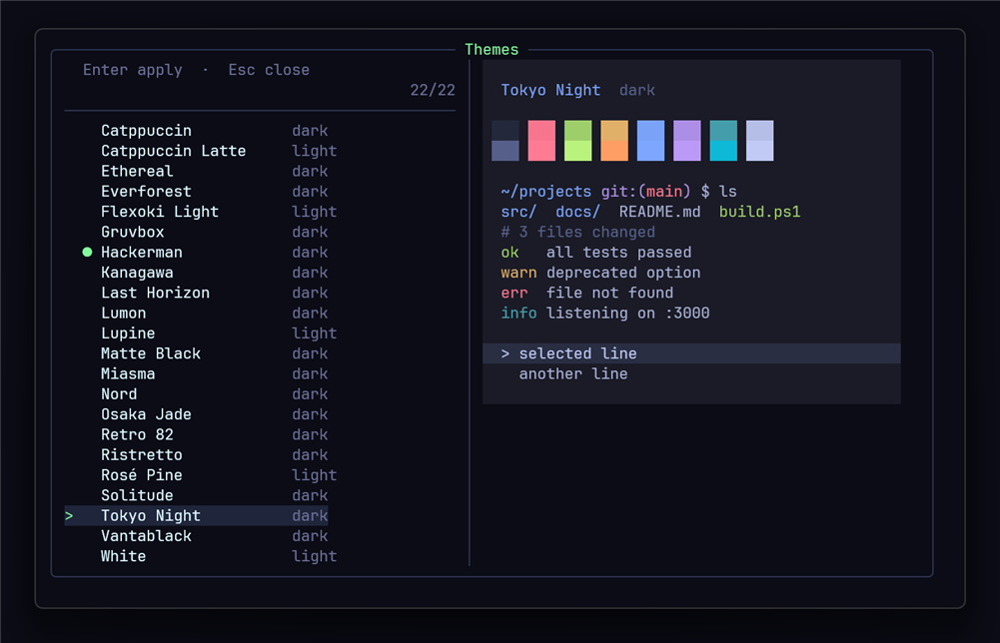
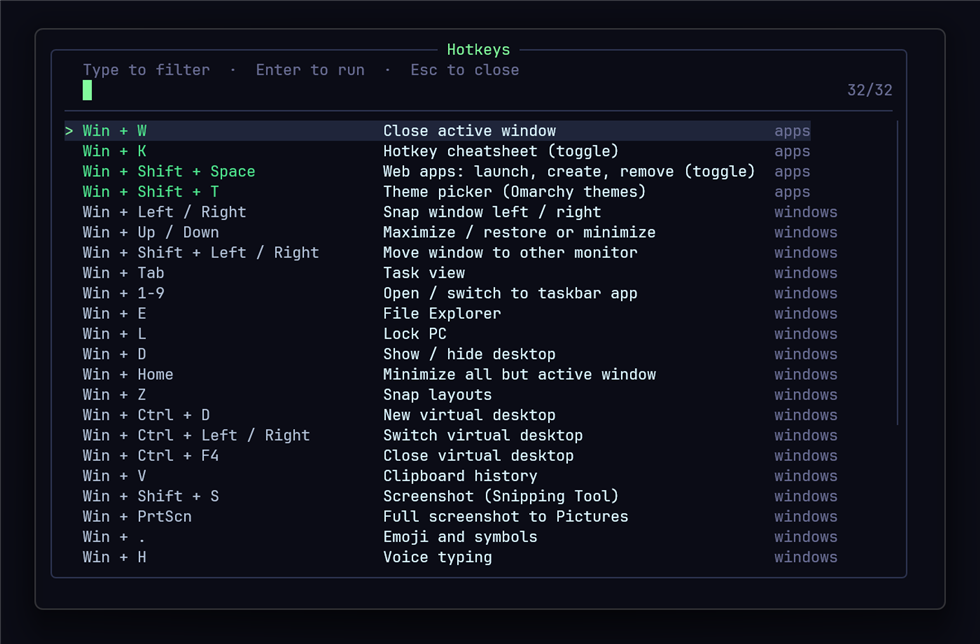
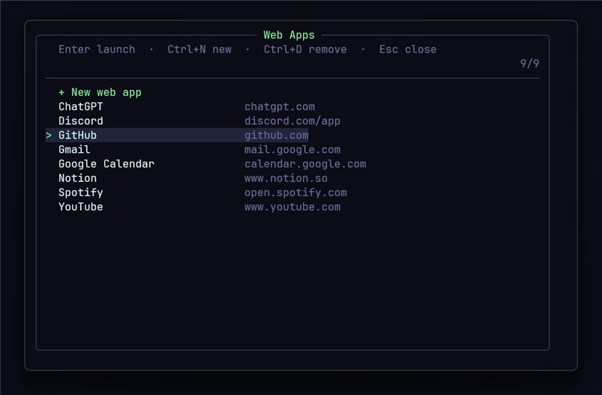

# BetterHotkeys

Omarchy-style keyboard menus for Windows 11. Press a hotkey and a small terminal menu pops up in the middle of the screen. Type to filter, press Enter to act, press Esc to close.

- **Win + K**: a searchable cheatsheet of your hotkeys. Press Enter to run the selected one.
- **Win + Shift + Space**: a web app maker and launcher. Turn any site into its own app window, like Omarchy's web apps.
- **Win + Shift + T**: a theme picker with all 22 [Omarchy](https://omarchy.org) themes for Windows Terminal and the menus.
- **Win + W**: close the active window.



## Download

**[Download BetterHotkeys.exe](../../releases/latest/download/BetterHotkeys.exe)** and run it. It takes a minute or two on a fresh PC.

Windows SmartScreen will probably say it "protected your PC", because the exe isn't code-signed. Click **More info → Run anyway**. If you'd rather not run an unsigned exe, the [code is all here](#building-from-source) and you can run `install.ps1` yourself.

Running it again is safe. It skips anything already installed and backs up files before replacing them. To remove it, see [Uninstalling](#uninstalling).

## What it installs

The installer uses [winget](https://learn.microsoft.com/windows/package-manager/winget/), Windows' built-in package manager, and skips anything you already have. If winget is missing or broken (on a brand-new account, for example), the installer sets it up first. It tries re-registering the copy Windows already has, then Microsoft's [WinGet PowerShell module](https://www.powershellgallery.com/packages/Microsoft.WinGet.Client), and finally downloads it straight from [winget's GitHub releases](https://github.com/microsoft/winget-cli/releases).

| Program | Why |
| --- | --- |
| [AutoHotkey v2](https://www.autohotkey.com) | Listens for the hotkeys |
| [fzf](https://github.com/junegunn/fzf) | The fuzzy-search menus |
| [PowerShell 7](https://github.com/PowerShell/PowerShell) | Runs the menu scripts |
| [Windows Terminal](https://github.com/microsoft/terminal) | Hosts the popups (already on Windows 11) |
| [JetBrainsMono Nerd Font](https://www.nerdfonts.com) | Terminal font |
| [Git](https://git-scm.com) | Handy to have |

Then it:

1. Copies the scripts to `Documents\AutoHotkey`.
2. Applies the Hackerman theme to Windows Terminal: colors, tab bar, font, cursor, padding and slight transparency. Your existing terminal settings are kept, and a backup is saved as `settings.json.before-betterhotkeys`.
3. Starts the hotkeys, and adds a shortcut to your Startup folder so they run at every sign-in.
4. Adds BetterHotkeys to **Settings → Apps** so you can [uninstall](#uninstalling) it like any other app.

## The menus

### Hotkey cheatsheet: Win + K



Lists your BetterHotkeys hotkeys (green) and common Windows shortcuts. Type to filter, and press Enter to run the selected hotkey. It closes when you press Esc or click away.

### Web apps: Win + Shift + Space



- **Ctrl + N** (or **+ New web app**): enter a URL and a name. If you've copied a link, the URL is filled in for you, and a name is suggested from the address. The site's icon is downloaded automatically.
- **Enter**: opens the app, or switches to it if it's already open.
- **Ctrl + D**: removes the app.

Each web app is a Start Menu shortcut in **Start Menu → Web Apps**, so you can also open it from Windows search or pin it to the taskbar. Apps open in your default browser's app mode, with no tabs or address bar. App mode needs a Chromium-based browser (Brave, Chrome, Edge, Vivaldi). If your default browser is something else, such as Firefox, Edge is used instead. Apps share your browser profile, so you're already signed in.

Icons come from [dashboard-icons](https://github.com/homarr-labs/dashboard-icons) (high-res icons for popular apps, the same source Omarchy uses), with the site's favicon as a fallback. You can also give your own icon URL when creating an app.

### Theme picker: Win + Shift + T

Lists all 22 Omarchy themes, with a live preview of each palette. Press Enter to apply one. A theme changes:

- Windows Terminal: colors, cursor, selection and tab bar. Light themes switch the terminal to light mode.
- The colors of the BetterHotkeys menus.

Themes: Catppuccin, Catppuccin Latte, Ethereal, Everforest, Flexoki Light, Gruvbox, Hackerman, Kanagawa, Last Horizon, Lumon, Lupine, Matte Black, Miasma, Nord, Osaka Jade, Retro 82, Ristretto, Rosé Pine, Solitude, Tokyo Night, Vantablack, White.

## Adding your own hotkeys

Open `Documents\AutoHotkey\hotkeys.ahk` and add a hotkey in [AutoHotkey v2](https://www.autohotkey.com/docs/v2/) syntax. To list it in the Win + K cheatsheet, put a `;;` comment above it in the form `Keys | Description`:

```autohotkey
;; Win + Enter | Terminal
#Enter:: Run("wt.exe")

;; Win + Shift + B | Browser
#+b:: Run("brave.exe")
```

Then double-click `hotkeys.ahk` to reload it. In AutoHotkey, `#` is Win, `+` is Shift, `^` is Ctrl and `!` is Alt.

## Files

| File | What it does |
| --- | --- |
| `install.ps1` | The installer. Runs in Windows PowerShell 5.1, which ships with Windows. |
| `uninstall.ps1` | The uninstaller. Registered in Settings → Apps by the installer. |
| `build.ps1` | Packages `install.ps1` and `src\` into `BetterHotkeys.exe` |
| `src\hotkeys.ahk` | The hotkeys, and a helper that opens the popup terminals |
| `src\cheatsheet.ps1`, `src\send-hotkey.ahk` | Win + K cheatsheet, and the helper that runs the selected hotkey |
| `src\webapps.ps1`, `src\webapp-lib.ahk`, `src\open-webapp.ahk` | Web app manager, and the code that opens or switches to apps |
| `src\themes.ps1`, `src\theme-lib.ps1`, `src\themes.json` | Theme picker, shared theme colors, and the Omarchy palettes |

## Building from source

The exe is a self-extracting package made with IExpress, which is built into Windows, so there's nothing extra to install:

```powershell
git clone https://github.com/Wyatt852456/BetterHotkeys
cd BetterHotkeys
.\build.ps1        # creates BetterHotkeys.exe
```

You can also skip the exe and run the installer straight from the folder. To do that, copy `src\*` next to `install.ps1`, then run:

```powershell
powershell -ExecutionPolicy Bypass -File install.ps1
```

If you've edited the scripts in `Documents\AutoHotkey`, `.\build.ps1 -SyncFromLive` copies them into `src\` before building. `src\hotkeys.ahk` is left alone, since it's the version for new PCs.

## Uninstalling

Open **Settings → Apps → Installed apps**, find **BetterHotkeys**, and click **Uninstall**. It:

- stops the hotkeys and removes them from startup
- deletes the BetterHotkeys scripts from `Documents\AutoHotkey`. This includes `hotkeys.ahk`, so copy it first if you added hotkeys you want to keep.
- asks whether to remove your web apps too
- resets Windows Terminal to its default theme, font and cursor. Your profiles and other settings are kept, and the previous file is saved as `settings.json.before-uninstall`.
- uninstalls the programs that setup installed: AutoHotkey, fzf, JetBrainsMono Nerd Font and Git. Programs you already had before running setup are left alone. **PowerShell 7 and Windows Terminal are always kept**, since Windows 11 ships with Terminal.

If Settings doesn't list BetterHotkeys (for example, you installed v1.0.0), run [`uninstall.ps1`](uninstall.ps1) yourself. It will ask about each program instead:

```powershell
powershell -ExecutionPolicy Bypass -File uninstall.ps1
```

## Credits

- Themes and the overall idea come from [Omarchy](https://github.com/basecamp/omarchy) by Basecamp (MIT license). The palettes in `themes.json` are converted from each theme's `colors.toml`.
- Built on [AutoHotkey](https://www.autohotkey.com), [fzf](https://github.com/junegunn/fzf) and [Windows Terminal](https://github.com/microsoft/terminal).
- Web app icons come from [dashboard-icons](https://github.com/homarr-labs/dashboard-icons).

## License

[MIT](LICENSE)
